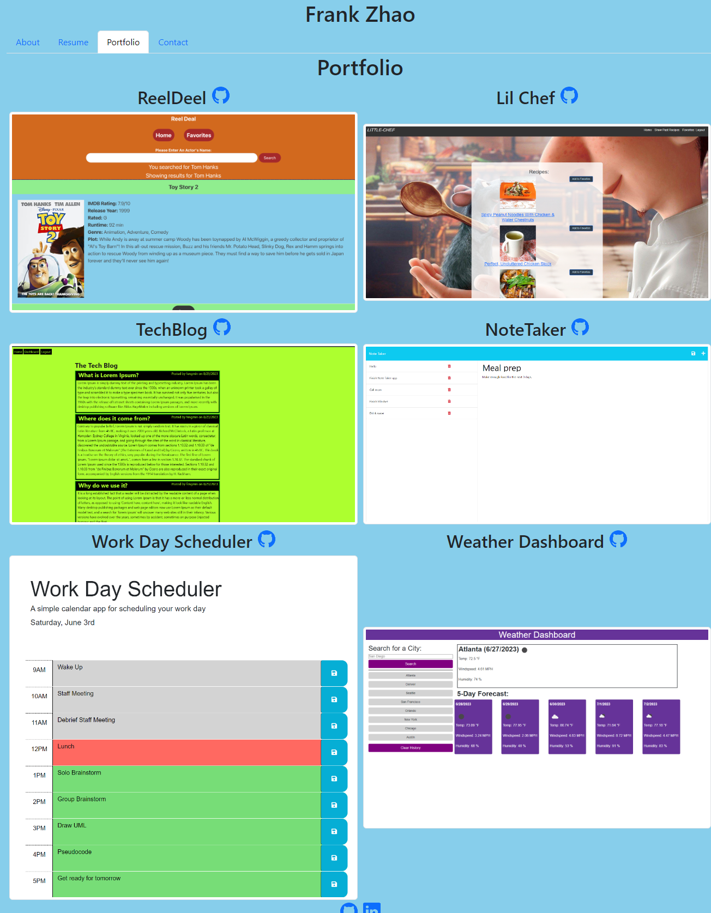

#  React-Portfolio

  ## Description
  I build this React Portfolio web app to help showcase the body of work I have accomplish thus far to recruiters. I know it will help recruiters because:   

  AS AN employer looking for candidates with experience building single-page applications, 
  I WANT to view a potential employee's deployed React portfolio of work samples, 
  SO THAT I can assess whether they're a good candidate for an open position.
  
  
  ## Table Of Contents
  - [Installation](#installation)
  - [Usage](#usage)
  - [License](#license)
  - [How To Contribute](#how-to-contribute)
  - [Tests](#tests)
  - [Questions](#questions)
         
  
  ## Installation
 N/A

  ## Usage
 To use this webpage, simply visit https://fzhao888.github.io/React-Portfolio/.
  
  Screenshot: 
  

  ## License
  

  License Link: https://opensource.org/licenses/MIT
  
  ## How To Contribute
 Please click [here](github.com/fzhao888/React-Portfolio) to contribute 
  
  ## Tests
  N/A
  
  ## Questions
  If you have any questions, please here is my contact info:

  GitHub:  [fzhao888](https://github.com/fzhao888)

  Email: frank.zhao93@gmail.com